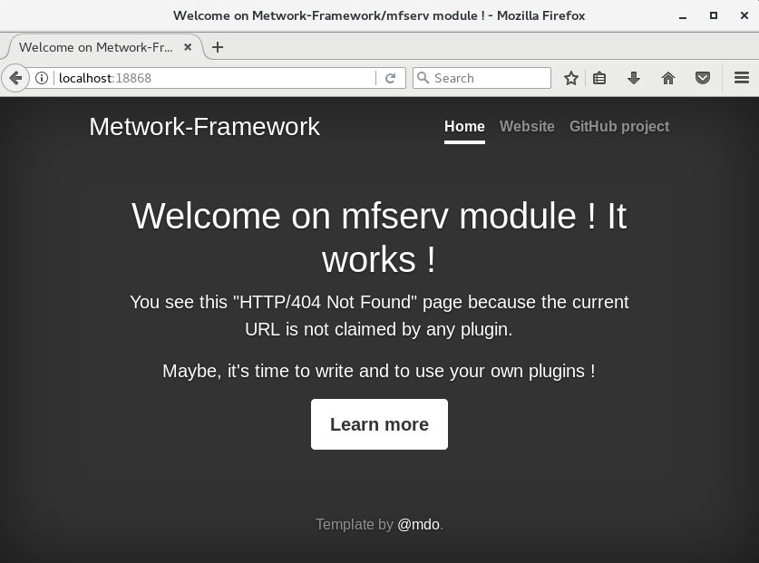
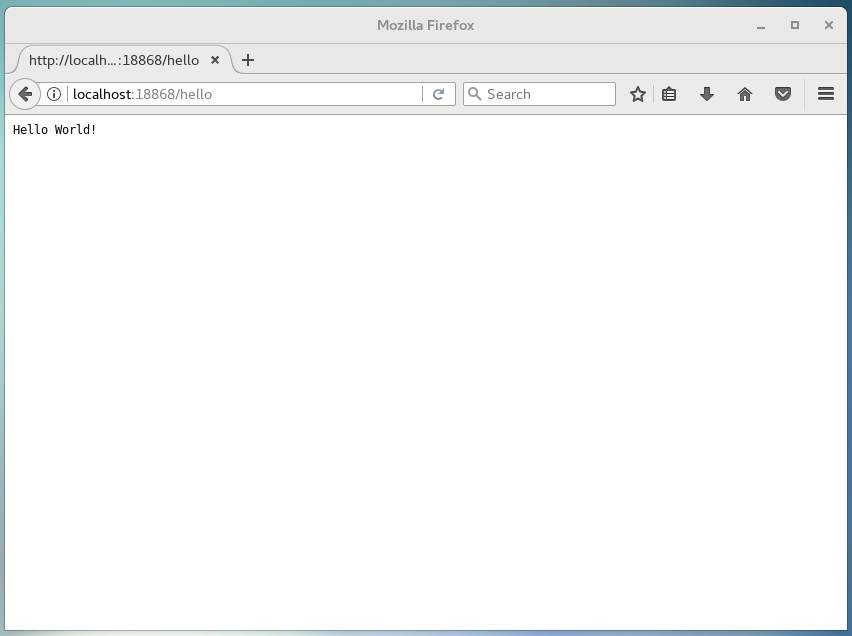

[< Previous step: Installation](./1_installation.md)

## Create your first API: Hello World

We are going to use mfserv module to create a web API.

First, we need to launch mfserv service. You could launch mfserv individually, but the easiest way is to use a command that will launch all installed metwork services at once. As root user:

``` bash
service metwork start
```

When it's done, you can check that mfserv is working. Open this url in your browser: `http://localhost:18868`

You should see this:



Let's create our first api. In MetWork Framework, we put our code in 'plugins'. Thus, we are going to create our first plugin now.

When we installed mfserv module, the installer has created a 'mfserv' user. Let's login as mfserv, and then create our plugin. We will call our plugin 'hello':

``` bash
su mfserv
cd ~
bootstrap_plugin.py create hello
```

Press enter several times to accept default values.

Now we need to launch our plugin. We launch it in 'develop' mode. In this mode, every modification to our plugin code will immediately launch a build, and thus you will see them in the browser.

``` bash
# As mfserv user
cd ~/hello
make develop
```

Open this url in your browser: `http://localhost:18868/hello`. You should get this:



If you get a __bad gateway error__, just wait a few seconds for your plugin to start, and try again.

[Next step: Put some code in your API >](./3_second_api.md)