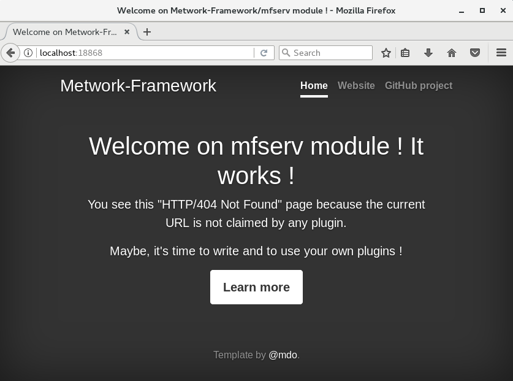
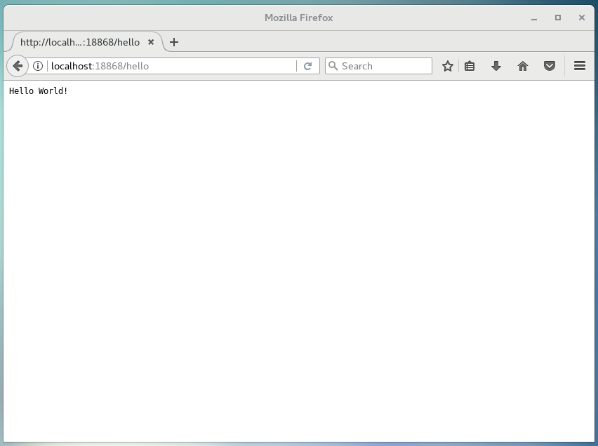
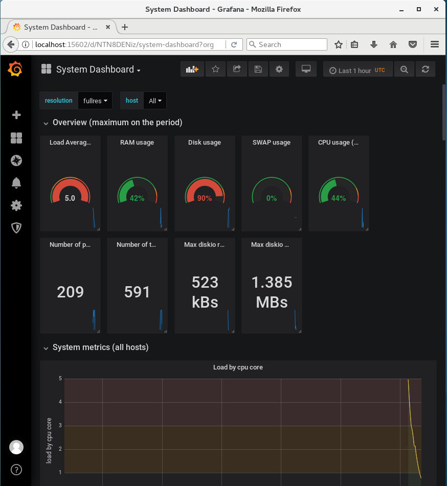

# Getting started tutorial - Metwork Framework

## Welcome to the Metwork Framework

The MetWork Framework will litterally change the way you build, run and monitor your applications. You are going to save a lot of time!

In this tutorial, we are going to take a fresh CentOS 7 VM, install MetWork Framework, build a small api with the framework. And then we will see how we can monitor this api, deploy it, connect it to a database, and create bullet proof background tasks.

All these steps should take less than 20 minutes!

## Installation

For this tutorial, we are going to start with a fresh CentOS 7 VM. If it's not a fresh CentOS, it should also work of course.

First, register the MetWork Framework stable repository. Login as root, copy the following command and paste it in a terminal.

``` bash
cat >/etc/yum.repos.d/metwork.repo <<EOF
[metwork_stable]
name=MetWork Stable
baseurl=http://metwork-framework.org/pub/metwork/releases/rpms/stable/centos7/
gpgcheck=0
enabled=1
metadata_expire=0
EOF
```

MetWork Framework is organized in modules. We are going to install the webservice module: mfserv.

``` bash
yum -y install metwork-mfserv
```

That's all we need for now!

## Create your first API: Hello World

We are going to use mfserv module to create a web API.

First, we need to launch mfserv service. You could launch mfserv individually, but the easiest way is to use a command that will launch all installed metwork services at once. As root user:

``` bash
service metwork start
```

When it's done, you can check that mfserv is working. Open this url in your browser: `http://localhost:18868`

You should see this:



Let's create our first api. In MetWork Framework, we put our code in 'plugins'. Thus, we are going to create our first plugin now.

When we installed mfserv module, the installer has created a 'mfserv' user. Let's login as mfserv, and then create our plugin. We will call our plugin 'hello':

``` bash
su mfserv
cd ~
bootstrap_plugin.py create hello
```

Press enter several times to accept default values.

Now we need to launch our plugin. We launch it in 'develop' mode. In this mode, every modification to our plugin code will immediately launch a build, and thus you will see them in the browser.

``` bash
# As mfserv user
cd ~/hello
make develop
```

Open this url in your browser: `http://localhost:18868/hello`. You should get this:



If you get a __bad gateway error__, just wait a few seconds for your plugin to start, and try again.

## Put some code in our API

The code of our API is in the plugin 'main' directory.

``` bash
# As mfserv user
cd ~/hello/main
ls
```

You should see a _wsgi.py_ file. The default bootstrap template for mfserv is in Python WSGI. But you could have choosen other templates like python-django or nodejs.

To show you that MetWork can work with several languages, we are not going to edit this plugin. We are going to create another plugin in nodejs.

``` bash
# As mfserv user
bootstrap_plugin.py list
```

This command outputs the list of available plugin templates. Let's choose node.

``` bash
# As mfserv user
cd ~
bootstrap_plugin.py create --template=node tutorial
```

Press enter several times to accept default values.

And then launch your new plugin.

``` bash
cd tutorial
make develop
```

If you open `http://localhost:18868/tutorial` in your browser, you should see a 'Hello World tutorial' page.

The node template has bootstraped a nodejs express application. Let's edit the code to make it more interesting.

In `~/tutorial/tutorial/server.js`, Replace the line:

``` js
      res.send('Hello World tutorial!)
```

by:
``` js
      var entry = req.param('q')
      res.send('Hello World tutorial! You have entered: ' + entry)
```

Now open `http://localhost:18868/tutorial?q=foobar`

This should output in your browser: 'Hello World tutorial! You have entered: foobar'.

## Monitor your application

The MetWork Framework monitoring module is called mfadmin. It also contains the mfsysmon submodule which provides a system monitoring out of the box.

Let's install it. Login as root user, and install mfadmin and mfsysmon:

``` bash
# As root user
yum -y install metwork-mfadmin metwork-mfsysmon
```

Start the services:

``` bash
service metwork start
```

### System monitoring

Open `http://localhost:15602`in your browser, you will see the monitoring website, built upon Grafana open source project. Login with the following credentials:
* user: admin
* password: admin

For your first login, it will ask you to change your password. Just clic on 'skip' for now.

This monitoring website will give you access to several dashboards. You can already clic on 'System Dashboard', which will give you something like this:



### Application monitoring

TODO

